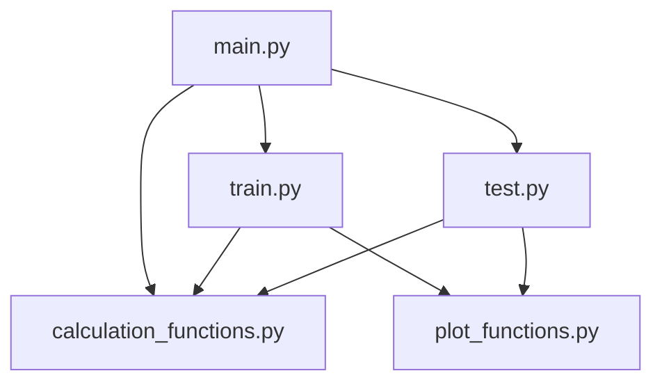

# Pytorch-PINN-Wave-Equation

## Table of contents
**Write content**
* [About](#about)
* [Project structure](#project-structure)
* [How to use](#how-to-use)
* [Results](#results)

## About
In this mini-project, I practiced the design of a Physics-Informed Neural Network (PINN) that can solve a wave equation. The equation is a Partial Differential Equation (PDE) that arises to solve physical problems such as wave propagation. The PDE is: $∇^{2}h = -c^{2}h_{tt}$, where $∇^{2}$ is the Laplace operator, $c=1$, and $h(x,t)$ is the complex wavefield with real and imaginary components denoted by $h(x,t) = u(x,t) + iv(x,t)$.
The PINN is trained on the domain $x∈[−1,1]$ and $t ∈ [0, 4]$, for arbitrary initial conditions $(u_0(x, t), v_0(x, t))$.

The chosen initial conditions and the boundary conditions are Dirichlet condition:

$$\begin{aligned}
h(-1, t) & =0 \\
h(1, t) & =0 \\
h(x, 0) & =u(x) \\
\left.\frac{\partial h(x, t)}{\partial t}\right|_{t=0} & =v(x)
\end{aligned}$$

The equations can be solved by many techniques, I solved with variable separation method and the solution is:

$u(x, t) = \cos\left(\frac{\pi t}{4}\right) \sin\left(\frac{\pi (x + 1)}{2}\right)$

$v(x, t) = \sin\left(\frac{\pi t}{4}\right) \sin\left(\frac{\pi (x + 1)}{2}\right)$

$h(x, t) = \cos\left(\frac{\pi t}{4}\right) \sin\left(\frac{\pi (x + 1)}{2}\right) + \sin\left(\frac{\pi t}{4}\right) \sin\left(\frac{\pi (x + 1)}{2}\right)i$

The model is trained on $u(x, t)$ and $v(x, t)$ separately and combined the output in order to calculate $h(x, t)$.

## Project structure



## How to use

Inside [main.py](https://github.com/Itamar-Gold/Pytorch-PINN-Wave-Equation/blob/main/main.py) in the first section you will find the following code:
```ruby
train = (True/False)
save = (True/False)
load = (True/False)
prepare_animation = (True/False)
```
**If you would like to train the model and test it later you can run:**
```ruby
train = True
save = True
load = False
prepare_animation = False
```
**If you would like to make an animation out of the training process:**
```ruby
train = True
save = False
load = False
prepare_animation = True
```
**If you would like to load the trained model:**
```ruby
train = False
save = False
load = True
prepare_animation = False
```
**Make sure that in the project folder you create 2 new folders:**
- [x] images (to save the images for the results)
- [x] model (to save the trained model state)

      
## Results

**The results for $u(x,t):$**

**The results for $v(x,t):$**

**The results for $|h(x,t)|:$**


**And by slicing the results for each time to create a 2D plot:**


